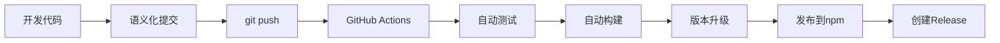

# 开发指南

## 🚀 自动化发布流程

本项目采用完全自动化的 CI/CD 流程，**只需要 `git push` 就能自动发布新版本到 npm**。

### 📋 发布流程



### 🔧 开发工作流

#### 1. 日常开发
```bash
# 修改代码
npm run dev          # 开发模式
npm test             # 运行测试
npm run build        # 构建验证

# 提交代码（使用语义化提交信息）
git add .
git commit -m "feat: 添加新功能"
git push             # 🎉 这是唯一需要的发布命令！
```

#### 2. 语义化提交规范

| 提交类型 | 版本影响 | 示例 |
|---------|---------|------|
| `fix:` | Patch (1.0.4 → 1.0.5) | `fix: 修复模板生成问题` |
| `feat:` | Minor (1.0.4 → 1.1.0) | `feat: 添加Vue3支持` |
| `BREAKING CHANGE:` | Major (1.0.4 → 2.0.0) | `feat: 重构CLI接口\\n\\nBREAKING CHANGE: 命令参数格式变更` |
| `docs:`, `chore:`, `style:` | 不发布 | `docs: 更新README` |

#### 3. 自动化功能

✅ **自动执行的操作：**
- 多版本 Node.js 测试 (16.x, 18.x, 20.x)
- TypeScript 编译和语法检查
- 单元测试执行
- CLI 功能测试
- 智能变更检测（只在有实际代码变更时发布）
- 基于提交信息的版本类型判断
- package.json 版本号自动升级
- CHANGELOG.md 自动更新
- 自动发布到 npm
- 自动创建 GitHub Release
- 自动创建和推送 Git 标签

### 🎯 最佳实践

#### ✅ 推荐做法
```bash
# 功能开发
git commit -m "feat: 添加React Router支持"

# Bug 修复  
git commit -m "fix: 修复TypeScript编译问题"

# 文档更新（不会触发发布）
git commit -m "docs: 更新API文档"

# 推送代码自动发布
git push
```

#### ❌ 避免的做法
```bash
# ❌ 不要手动执行这些命令（CI/CD会自动处理）
npm version patch
npm publish
git tag v1.0.5

# ❌ 不要使用模糊的提交信息
git commit -m "更新代码"
git commit -m "fix"
```

### 🔍 发布状态监控

推送代码后可以在以下位置查看发布状态：

1. **GitHub Actions**: `https://github.com/Andy258369/an-cli/actions`
2. **npm 包页面**: `https://www.npmjs.com/package/an-frame-cli`
3. **GitHub Releases**: `https://github.com/Andy258369/an-cli/releases`

### 🚨 紧急情况

如果需要手动干预或跳过 CI：

```bash
# 跳过 CI 发布（在提交信息中添加 [skip ci]）
git commit -m "docs: 更新文档 [skip ci]"

# 手动发布（仅紧急情况）
npm run build
npm test
npm version patch
npm publish
```

### 🔧 本地开发脚本

```bash
# 开发和构建
npm run dev          # 监听模式编译
npm run build        # 构建项目
npm test             # 运行测试
npm run clean        # 清理构建文件

# 版本管理（通常由 CI/CD 自动处理）
npm run version:patch    # 升级patch版本
npm run version:minor    # 升级minor版本  
npm run version:major    # 升级major版本
```

---

## 📝 提交信息模板

```
<type>: <description>

[optional body]

[optional footer(s)]
```

**示例：**
```
feat: 添加Vue 3.x模板支持

- 添加Vue 3.x项目模板
- 更新依赖配置
- 添加相应的测试用例

Closes #123
```